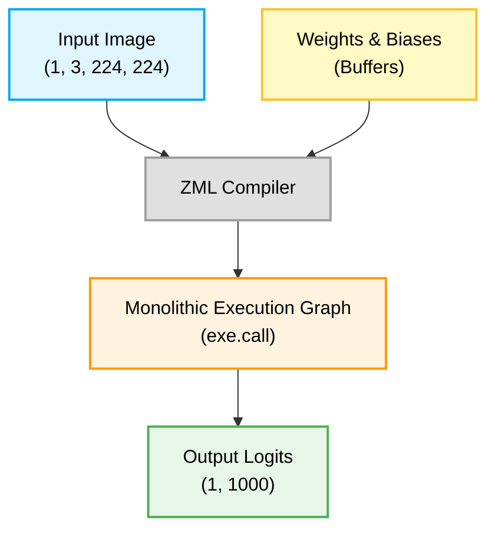
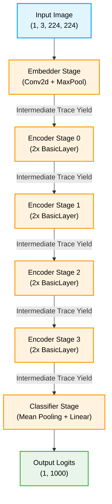

# ResNet-18 ZML Implementation

This project provides a high-performance inference implementation of the [ResNet-18](https://huggingface.co/microsoft/resnet-18) vision model using Zig and the [ZML](https://github.com/zml/zml) framework. 

It is designed with advanced Zero-Knowledge (ZK) proving techniques in mind, specifically featuring a sequential execution pipeline that breaks the model down layer-by-layer. This is particularly useful for recursive folding schemes (like Nova or Sangria).

## Background & References

### [Hugging Face Model Documentation](https://huggingface.co/docs/transformers/main/en/model_doc/resnet)
The ResNet model implementation follows small changes made by Nvidia (ResNet v1.5), applying stride=2 for downsampling in the bottleneck's 3x3 convolution. ResNet introduced residual connections, allowing networks to train with an unseen number of layers.


### [Microsoft ResNet-18 Model Card](https://huggingface.co/microsoft/resnet-18)
The official model card for the ResNet-18 model checkpoint used in this project. As a milestone in deep computer vision, ResNet architectures enable training networks with an unprecedented number of layers, winning the 2015 ILSVRC & COCO competitions.

### [Deep Residual Learning for Image Recognition](https://huggingface.co/papers/1512.03385)
*Kaiming He, Xiangyu Zhang, Shaoqing Ren, Jian Sun*
This foundational paper presents a residual learning framework to ease the training of substantially deeper networks. By explicitly reformulating layers as learning residual functions with reference to the layer inputs, it allowed for networks up to 152 layers deep, winning 1st place on the ILSVRC 2015 classification task.

## ZML Inference Pipelines (`pipeline.zig`)

The ZML application exposes two different inference strategies. Understanding the difference between these is crucial for the Zero-Knowledge component of this architecture.

### 1. Monolithic Inference (`generate`)

This method performs standard, black-box hardware inference. The entire ResNet-18 architecture is compiled into a single, unified computation graph and executed on the accelerator in one shot. 

*   **Pros:** Maximum performance and hardware optimization.
*   **Cons:** Cannot be effectively proven via Zero-Knowledge because the entire execution trace (roughly 27.7 million constraints) would need to be materialized in RAM simultaneously, far exceeding hardware limits.



### 2. Sequential Inference (`generateSequential`)

This method breaks the model execution down into discrete stages (Embedder, Encoder Stages 0-3, and Classifier). The compilation and execution yield an intermediate activation tensor at the end of each stage before passing it to the next.

*   **Why does this exist?** Zero-Knowledge proofs for heavy neural networks easily exceed hardware limits if proven monolithically. This function is designed explicitly for **Recursive Layer Folding** (like Nova or Sangria). By yielding the intermediate trace sequentially, a separate ZK-Prover can prove a single layer's constraints and fold them into a constant-sized accumulator state, dropping memory consumption from $O(Depth)$ to localize $O(Layer)$.



A suite of Python/PyTorch reference implementations is also included for validation and structural parity testing.

## Prerequisites

- **Zig** & **ZML**: For building and running the main inference engine.
- **Bazel**: For building the Zig project.
- **Hugging Face Hub CLI** (`hf`): For downloading the model weights and datasets.
- **uv**: For managing the Python virtual environment.

## 📥 Setup & Downloads

First, download the ResNet-18 model weights (excluding the `.pth` PyTorch binaries, as we use `safetensors`) and the sample image dataset.

```bash
# Create directories
mkdir -p $HOME/models/resnet-18
mkdir -p $HOME/dataset/cats-image

# Download model (safetensors + config)
hf download microsoft/resnet-18 --local-dir $HOME/models/resnet-18 --exclude='*.pth'

# Download sample cats dataset
hf download huggingface/cats-image --repo-type dataset --local-dir $HOME/dataset/cats-image
```

## 🚀 Zig Implementation (ZML)

The core ZML implementation is located in the root directory:
- `main.zig`: Application entry point and CLI args parsing.
- `pipeline.zig`: The execution engine containing `generate` (standard inference) and `generateSequential` (layer-by-layer inference designed for Nova integration).
- `resnet18.zig`: The model architecture definition matching the HuggingFace safetensors.
- `utils.zig`: Image preprocessing (resizing, center cropping, ImageNet normalization) using `stb_image`.

### Running Inference

Use Bazel to run the Zig implementation. You can pass the paths to the model, config, and image as command-line arguments:

```bash
bazel run //resnet-18 -- \
  --model=$HOME/models/resnet-18/model.safetensors \
  --config=$HOME/models/resnet-18/config.json \
  --image=$HOME/dataset/cats-image/cats_image.jpeg
```

*(Note: The above CLI arguments match the expected defaults in `main.zig`, so a simple `bazel run //resnet-18` will also work if your files are in these exact locations.)*

## 🐍 Python Reference Implementations

We provide three Python scripts in the `python/` directory, illustrating the progression from standard HuggingFace usage to an explicit, 1-to-1 mirror of the ZML architecture.

### Setup

```bash
# Initialize and sync the virtual environment using uv
uv venv
source .venv/bin/activate
uv sync
```

### 1. Standard HuggingFace (`resnet18.py`)
Uses `AutoImageProcessor` and `AutoModelForImageClassification` for full black-box inference.
```bash
python3 python/resnet18.py
```

### 2. Manual Preprocessing (`resnet18-simple.py`)
Replaces the `AutoImageProcessor` with explicit NumPy/PIL preprocessing steps (resizing, center cropping to 224x224, and ImageNet normalization) to illustrate the exact math required.
```bash
python3 python/resnet18-simple.py
```

### 3. Explicit Architecture (`resnet18-pytorch-pipeline.py`)
A complete PyTorch rewrite of the ResNet-18 architecture. It avoids the `transformers` library entirely, loading the `safetensors` checkpoint directly into custom PyTorch modules (`ResNetConvLayer`, `ResNetEncoder`, `ResNetEmbedder`). This mirrors the Zig `resnet18.zig` component layout precisely and is ideal for debugging structural parity.
```bash
python3 python/resnet18-pytorch-pipeline.py
```
