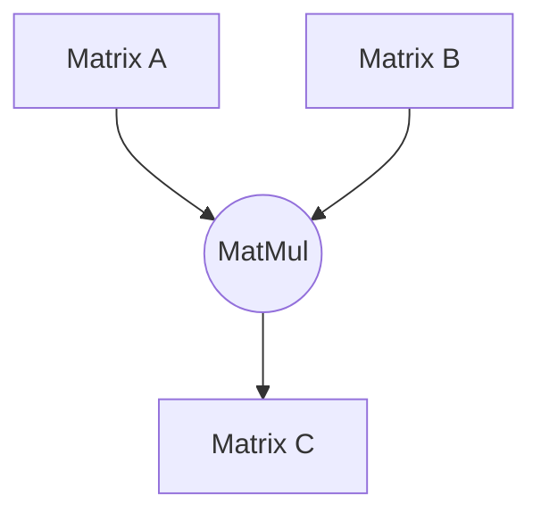
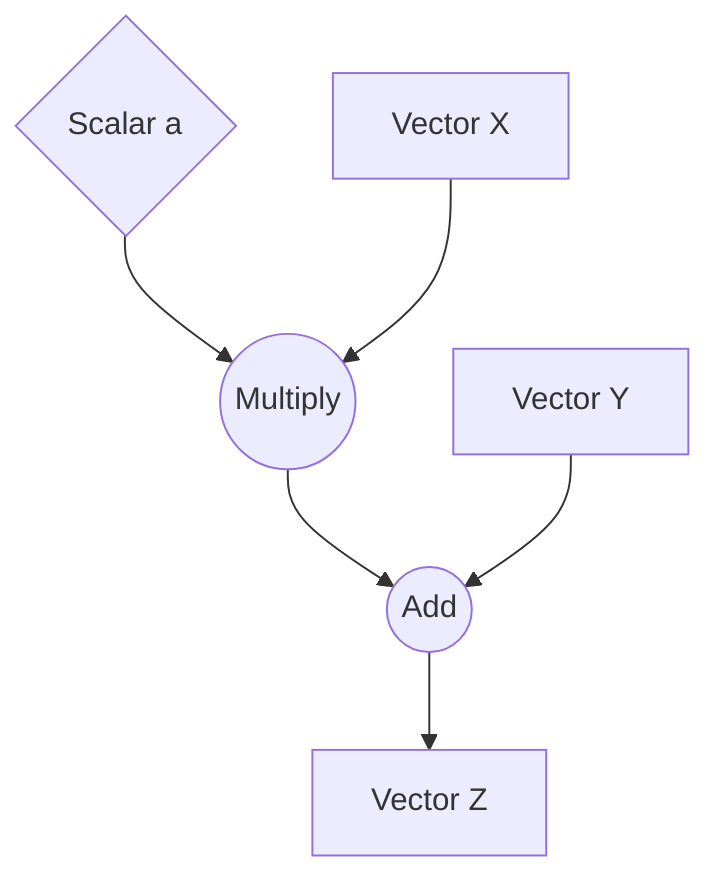
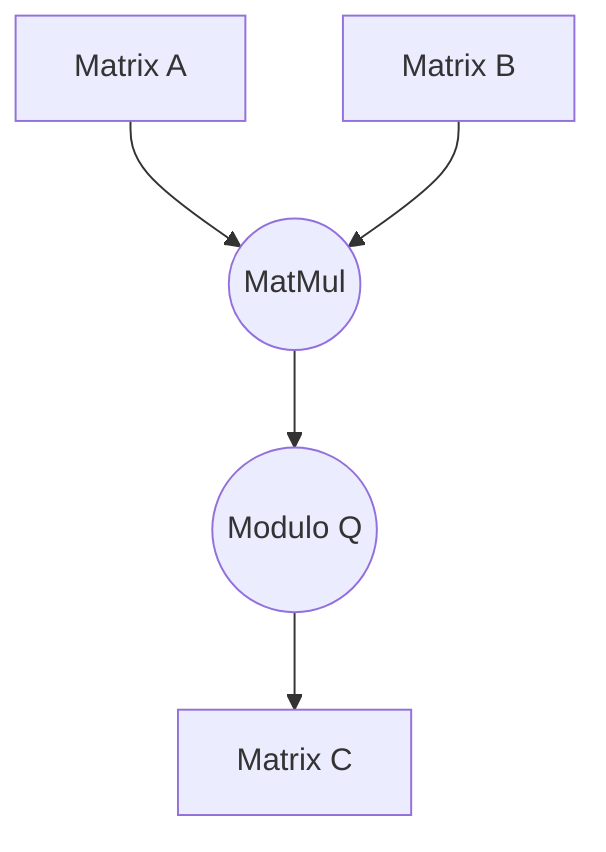
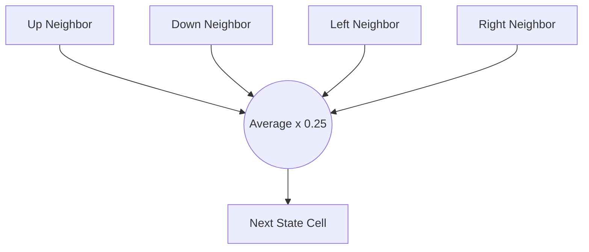
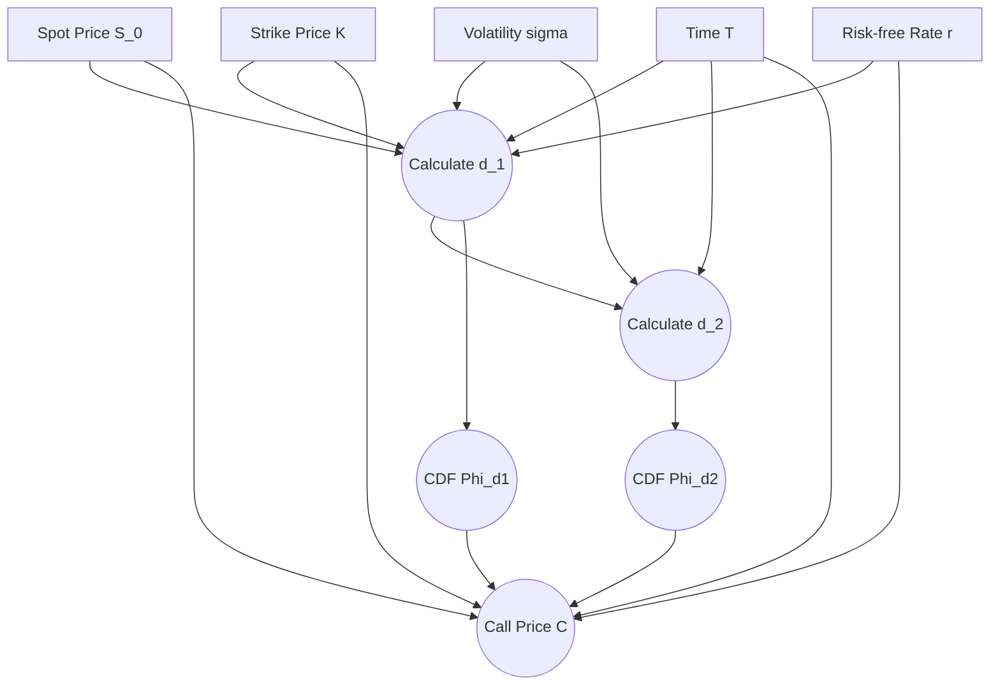

# Zig & ZML Algorithm Benchmark Suite

## Overview

The `simple` project is a high-performance benchmarking suite written in Zig that compares the execution speed and correctness of various mathematical and financial algorithms. It explicitly contrasts scalar, CPU-optimized, and hardware-accelerated ML tensor paradigms, allowing developers to understand the trade-offs in implementation complexity and execution speed across common algorithmic kernels. 

By evaluating three distinct implementation strategies (a naive reference approach, a highly optimized CPU approach using multithreading and SIMD, and a tensor-based approach utilizing the Zig Machine Learning `zml` library), the project serves as an educational and benchmarking tool to demonstrate how to achieve high performance in Zig.

The project uses Bazel as its build system.

## Benchmarked Algorithms

The suite measures the performance of the following algorithms:

### 1. MatMul
Standard matrix multiplication.
$$C_{i,j} = \sum_{k} A_{i,k} B_{k,j}$$



### 2. SAXPY
Single-precision scalar multiplication and vector addition ($aX + Y$).
$$Z_i = a \cdot X_i + Y_i$$



### 3. ModMatMul
Integer matrix multiplication with a modulo operation ($Q = 3329$) applied to the result.
$$C_{i,j} = \left( \sum_{k} A_{i,k} B_{k,j} \right) \pmod{Q}$$



### 4. Heat Transfer
A 2D grid simulation iteratively updating cell values based on the $0.25$ average of up, down, left, and right neighbors.
$$U_{i,j}^{(t+1)} = \frac{1}{4} \left( U_{i-1,j}^{(t)} + U_{i+1,j}^{(t)} + U_{i,j-1}^{(t)} + U_{i,j+1}^{(t)} \right)$$



### 5. Black-Scholes
A mathematical model for pricing European call and put options, calculating a standard normal cumulative distribution function (CDF).
$$C = S_0 \Phi(d_1) - K e^{-rT} \Phi(d_2)$$
$$d_1 = \frac{\ln(S_0/K) + (r + \sigma^2/2)T}{\sigma \sqrt{T}}$$
$$d_2 = d_1 - \sigma \sqrt{T}$$



## Implementation Strategies

Each algorithm is implemented in three ways to compare performance profiles:

1. **Reference (`reference.zig`):** A baseline, single-threaded implementation using standard nested Zig `for` and `while` loops.


2. **Optimized (`optimized.zig`):** A CPU-optimized implementation that leverages:

    - **Multithreading:** Uses `std.Thread.spawn` to divide workloads across up to 16 threads.
    - **SIMD Vectorization:** Utilizes Zig's `@Vector` builtin to process multiple elements simultaneously (e.g., vector lengths of 16 or 64).
    - **Loop Tiling:** Implements block-based traversal for cache efficiency in matrix operations (e.g., chunking matrices into 64x64 blocks).


3. **ZML / Tensor (`model.zig`):** A machine-learning-style implementation using the `@zml//zml` package. Models are constructed using tensor operations (`.dot()`, `.add()`, `.slice()`, `.exp()`) and executed via the compiled ZML platform backend.


## Project Structure

* **`BUILD.bazel`**: Contains the Bazel build targets (`simple_lib`, `simple`, `simple_test`, and `simple_test_zml`).
* **`main.zig`**: The entry point that initializes the context and triggers the benchmarks.
* **`benchmarks.zig`**: The core runner that allocates buffers, measures execution time (`std.Io.Clock`), and verifies that the Optimized and ZML outputs match the Reference outputs using a defined epsilon.
* **`context.zig`**: Manages memory allocators, standard random number generation, and the `zml.Platform` state.
* **`model.zig`**: Defines the `SimpleModel` struct containing all ZML tensor logic.
* **`optimized.zig`**: Contains the parallelized and vectorized algorithm implementations.
* **`reference.zig`**: Contains the baseline scalar implementations.
* **`tests.zig` & `tests_zml_main.zig`**: Unit tests verifying the mathematical correctness of both the optimized code and the ZML models against expected values.


## Prerequisites

* **Zig** toolchain (compatible with the versions specified in your Bazel workspace).
* **Bazel** build system.

## Usage

Because the project uses Bazel, you can build, run, and test the suite using standard Bazel commands.

**To run the main benchmark suite:**

```bash
bazel run //simple
```

**To run the standard unit tests (verifying `optimized.zig` vs `reference.zig`):**

```bash
bazel test //simple:simple_test
```

**To run the ZML specific tests:**

```bash
bazel run //simple:simple_test_zml
```
