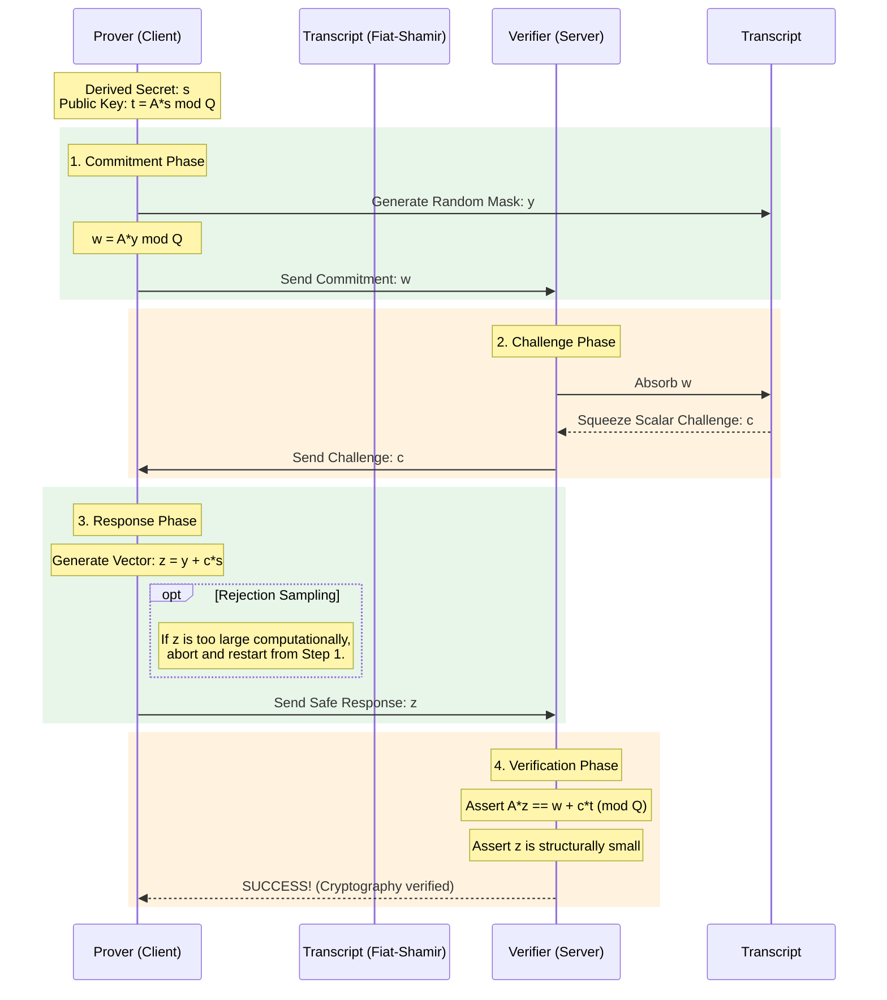

# Zero-Knowledge Password Proof (Zerkerus)

Welcome to the **Zerkerus Zero-Knowledge Password Proof** project. This repository implements a full-stack, hardware-accelerated Zero-Knowledge Proof (ZKP) designed to authenticate a user's password cryptographically without ever exposing the password itself to the server. 

By bridging ZML (Zig Machine Learning) matrix computations with the **Labrador** framework and Lattice-based BDLOP commitments, this system allows a Prover (Client) to convince a Verifier (Server) that they hold a specific secret structure, utilizing the interactive **Merlin-Arthur Protocol**.

### 🟢 Current Operational Status
- **Functional End-to-End Protocol:** The `main.zig` program successfully runs a unified Prover/Verifier Merlin-Arthur sequence locally on Apple Silicon.
- **Modular Architecture:** The codebase is separated into distinct modules (`params.zig`, `utils.zig`, `math.zig`, `flatbuf_tools.zig`) for clearer separation of cryptographic constants, utilities, ZML/Zig math, and serialization.
- **Finite Fields Integration:** Fully utilizes the Dilithium/Kyber Prime Field ($Q = 8380417$) for all matrix optimizations, executing bounded mathematical verification flawlessly over the ZML MLIR backend.
- **Zero-Knowledge Determinism:** Mathematical rejection-sampling correctly handles bounded aborts to ensure no statistical leakage of the witness occurs.
- **FlatBuffers Serialization:** Accepted proofs are serialized into compact binary FlatBuffers (~12 KB), enabling efficient client–server proof exchange.

---

## 🚀 The Architecture at a Glance

This project executes a strict dialogue between the Client and the Server to verify secret ownership:



## 🔬 Scientific & Technical Internals

### 1. Lattice Cryptography & Matrix Hardware (`@zk-crypto/ntt.zig`)

At the core of the verification is Lattice-based cryptography. We operate over the polynomial ring mapped to a $256 \times 1024$ dimensional subspace using the generic `@zk-crypto` engine.

$$T = \mathbf{A} \cdot S \pmod Q$$

**Key Implementations:**
*   **Hardware Matrix Operations:** We completely decouple standard looping vector logic by compiling operations explicitly into ZML `Tensor.dot()`. The ZML compilation layer delegates these tensor products physically to the underlying Apple Silicon matrix accelerators, executing evaluations simultaneously over the strictly enforced Kyber prime ($Q=8380417$).
*   **Modulo Identity Preservation:** Standard integer evaluations natively overflow memory footprints when executing multi-dimensional dot products constraint layers. Relying purely on ZML scalar definitions safely binds operations natively up to the limit of $\sim10^{19}$ avoiding $2^{64}$ limits prior to modulo reduction.

### 2. BDLOP Commitments & Rejection Sampling (`@zk-crypto/labrador.zig`)

Because the Client mathematically sends $Z = Y + c \cdot S$, and the server knows $c$ and $Z$, the structural shape of $S$ can statistically leak depending on the boundary conditions of $Y$. This is natively mitigated by `@zk-crypto/labrador.zig`.

**Zero-Knowledge Aborts (Rejection Sampling)**
To explicitly guarantee Zero-Knowledge properties, the mathematical norm of $Z$ must appear purely random to the Verifier.
The Prover operates a rejection sampling algorithm:
* The mask $Y$ is uniformly sampled across bounds bounded strictly by $8192 \cdot B$.
* The generated $Z$ is dynamically profiled. If it crosses the maximum acceptable bounds constraint $Limit_Y - \beta$, the Prover transparently aborts the current interaction, deletes all internal states, and automatically restarts the protocol with a completely new mask computationally preventing statistical degradation.

### 3. Fiat-Shamir Transcript (`@zk-crypto/fiat_shamir.zig`)

While the protocol can occur interactively between two network sockets natively, this simulation utilizes the Fiat-Shamir heuristic via a `blake3` cryptographic hash transcript natively attached via the wrapper library.
The Server deterministically guarantees the Prover did not cheat by implicitly agreeing upon the sequential challenge constants via sequential algorithmic transcript absorption.

---

## 📦 FlatBuffers Proof Serialization

Accepted ZKP proofs are serialized into compact FlatBuffer payloads using the [flatcc](https://github.com/dvidelabs/flatcc) C API, accessed from Zig via `@import("c")`.

### Schema Design (`zerkerus/idl/`)

Four `.fbs` schemas model the Labrador protocol phases:

| Schema | Fields | Description |
|--------|--------|-------------|
| `registration.fbs` | `public_seed: [ubyte]`, `public_key_t: [ulong]` | Public parameters |
| `commitment.fbs` | `w: [ulong]`, `attempt: uint` | Commitment vector + attempt counter |
| `challenge.fbs` | `c: ulong`, `transcript_hash: [ubyte]` | Fiat-Shamir challenge |
| `proof.fbs` | Nests all above + `z: [ulong]`, `verified: bool` | Root proof table |

### Zig ↔ flatcc Integration

The flatcc C builder API is used via the Bazel `flatcc_library` rule, which compiles `.fbs` schemas into C headers accessible through `@import("c")`.

> **Note:** Use the `_create(ptr, len)` API for scalar vectors (`[ubyte]`, `[ulong]`) rather than `_start/_push/_end` — the inline push functions do not translate correctly through Zig's C interop layer.

### Serialized Output

```
info: [FlatBuf] Proof serialized: 12486 bytes
info: [FlatBuf] Registration: public_seed length = 32, public_key_t length = 256
info: [FlatBuf] Commitment: attempt = 1, w length = 256
info: [FlatBuf] Challenge: c = 1, transcript_hash length = 32
info: [FlatBuf] Response: z length = 1024
info: [FlatBuf] Verified: true
```

---

## 🖥 Compilation & Execution

This module operates naturally inside Bazel.

```bash
# Compile and simulate a verifiable execution
# Uses ZML MLIR Compiler backend for MacOS Apple Silicon execution
bazel run //zerkerus

# Run unit tests across all project modules at once
bazel test //zerkerus:zerkerus_test

# Run unit tests for individual modules
bazel test //zerkerus:zerkerus_utils_test
bazel test //zerkerus:zerkerus_math_test
bazel test //zerkerus:zerkerus_flatbuf_test

bazel build //zerkerus:test_iree --sandbox_writable_path=/
```
