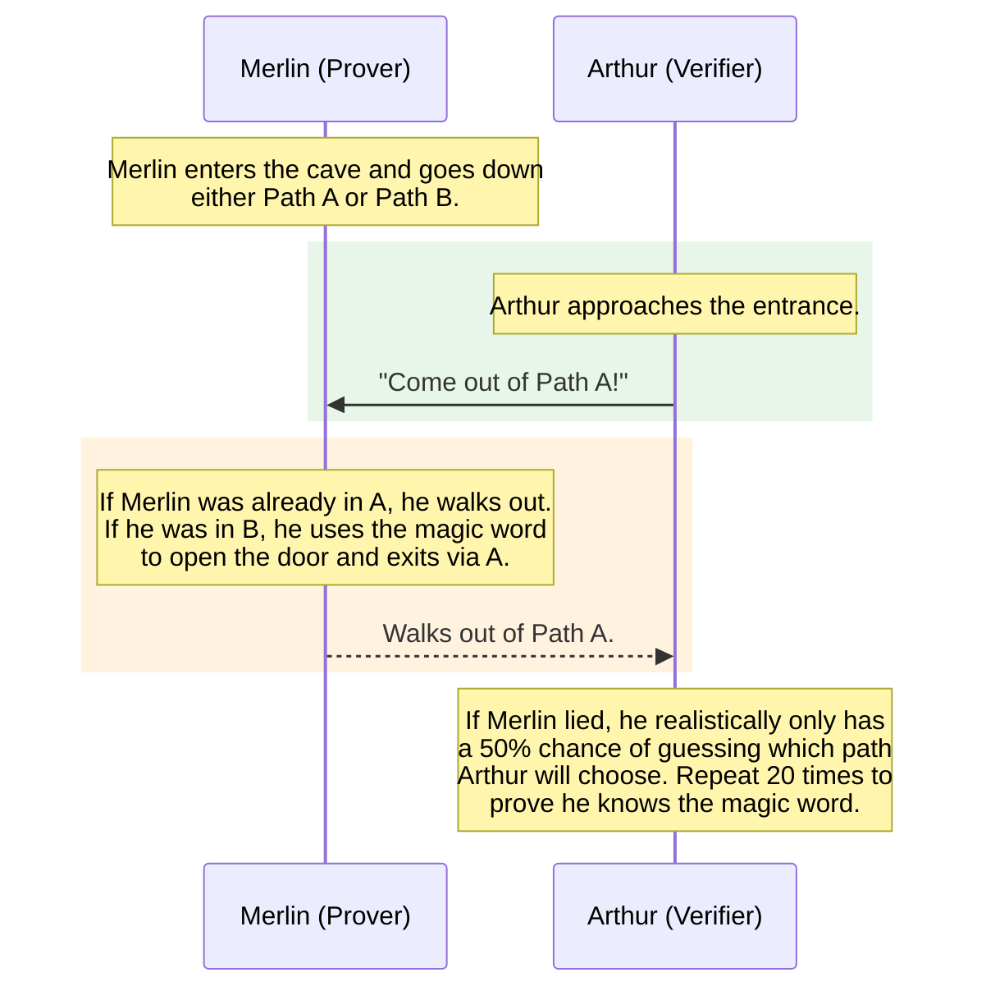
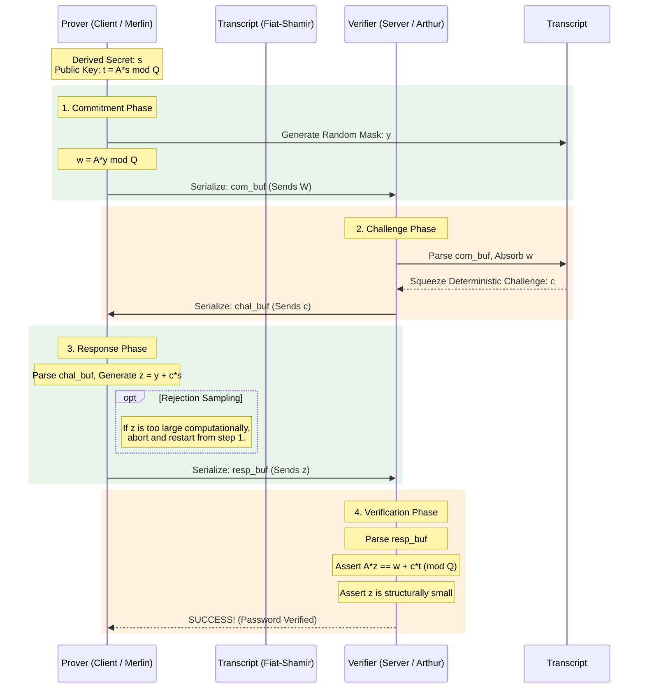
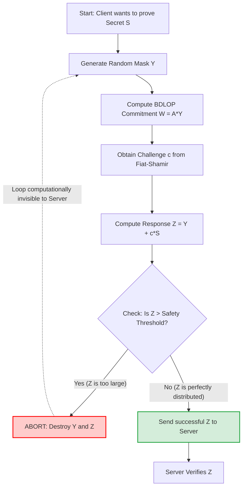

# Zerkerus Documentation: Zero-Knowledge Proofs, Lattices, Labrador, and NTT

This document provides a comprehensive overview of the mathematics, cryptography, and protocols underlying **Zerkerus**. It explains the core concepts of Zero-Knowledge Proofs (ZKPs), Lattice Cryptography, the Number Theoretic Transform (NTT), the Labrador proof system, and how these elements secure authentication better than traditional methods.

## 1. What is Authentication?

At its core, **Authentication** is the process of verifying that an entity (a user, device, or system) is who they claim to be before granting them access to a secure resource. 

In cybersecurity, authentication ensures trust. It answers the critical question: *"Can I mathematically or logically prove that this specific person is the rightful owner of this account?"*

### The Core Properties of Secure Authentication
A robust authentication system doesn't just check a password; it guarantees several fundamental properties:
- **Identification:** Establishing *who* you claim to be (e.g., providing a username).
- **Authentication:** Proving you actually *are* that identity (e.g., providing a password, a fingerprint, or a cryptographic proof).
- **Authorization:** Determining *what* you are allowed to do once your identity is verified (e.g., you can read your own files, but not an admin's files).
- **Non-Repudiation:** A mathematical guarantee that the authenticated person cannot later deny performing an action. (e.g., if you sign a digital transaction, you cannot later claim someone else did it, because only your secret key could have generated that signature).
- **Traceability (Accountability):** The ability to securely log and trace all actions back to a uniquely authenticated identity, ensuring an unbroken audit trail for compliance and forensic investigations.

### The 5 Ws & 1 H of Authentication

- **Who:** The **Entity** (a human user, an API client, or an autonomous server) attempting to access a system.
- **What:** The **Credential** the entity presents. This falls into three categories:
  - Something you *know* (a password or PIN).
  - Something you *have* (a physical security key, a smart card, or a phone with an authenticator app).
  - Something you *are* (biometrics like a fingerprint or FaceID).
- **Where:** The **Boundary** where the verification occurs. This can happen locally on your physical device (like unlocking your laptop) or remotely across the internet (like logging into a banking server).
- **When:** The **Trigger**, which occurs precisely at the moment of access request, and typically requires renewal (session timeouts) to ensure the entity hasn't abandoned the terminal.
- **Why:** The **Purpose** is to prevent unauthorized access, protect sensitive data from theft, maintain user privacy, and uphold the integrity of the system against malicious actors.
- **How:** The **Protocol**. Traditionally, this meant sending a password over a TLS-encrypted wire for the server to hash and compare against a database. In modern web3 and high-security environments (like **Zerkerus**), this is done using **Zero-Knowledge Cryptography**—proving you know the password without ever sending it to the server.

---

## 2. What are Lattices?

### In General Mathematics
A **lattice** is a set of points in an $n$-dimensional space with a periodic structure, similar to a grid. If you take a set of linearly independent vectors (called a *basis*), a lattice is the set of all possible points you can reach by adding or subtracting integer multiples of those vectors. 
- In 2D, it looks like the intersections on a piece of graph paper. 
- In higher dimensions (e.g., 256 or 1024 dimensions), it becomes an incredibly complex geometric structure.

### In Cryptography
**Lattice-based cryptography** relies on the mathematical hardness of finding specific points within these high-dimensional lattices.
- **The Hard Problem**: Given a "good" basis (short, nearly orthogonal vectors), it's easy to find points close to the origin. However, if you are only given a "bad" basis (long, highly skewed vectors) that generates the exact same lattice, finding the shortest non-zero vector (the *Shortest Vector Problem* or SVP) or finding the closest lattice point to an arbitrary point in space (the *Closest Vector Problem* or CVP) is computationally intractable.
- **Post-Quantum Security**: Unlike factoring large primes (RSA) or calculating discrete logarithms (Elliptic Curves), which quantum computers can break easily using Shor's algorithm, there is currently no known quantum algorithm that can efficiently solve these hard lattice problems. Therefore, lattice cryptography is considered **post-quantum secure**.

### Module-SIS (Module Short Integer Solution)
The **Module-SIS** problem is the specific lattice hardness assumption that secures the *commitment* and *verification* steps in Zerkerus.

- **The Problem**: Given a public matrix $A$ (composed of polynomial modules over the ring $\mathbb{Z}_Q[X] / (X^N + 1)$), find a "short" vector $S$ such that $A \cdot S = 0 \pmod Q$. "Short" means every coefficient in $S$ is small (close to zero).
- **Why it's Hard**: In high dimensions ($N = 1024$), there are astronomically many possible short vectors, but finding one that satisfies the equation is computationally equivalent to solving the Shortest Vector Problem (SVP) on the underlying lattice—a problem no known classical or quantum algorithm can solve efficiently.
- **How it's Used in Zerkerus**: When the Prover publishes $T = A \cdot S \pmod Q$, an attacker who wants to recover the secret password $S$ must solve the Module-SIS problem. The public key $T$ is safe to store on the server because reversing $A \cdot S$ is intractable. Furthermore, during verification, the Server checks $A \cdot Z = W + c \cdot T$—this equation is sound because forging a valid $Z$ without knowing $S$ requires solving Module-SIS.

### Module-LWE (Module Learning With Errors)
The **Module-LWE** problem is the complementary hardness assumption that secures the *hiding* property of commitments and the *indistinguishability* of the Prover's mask.

- **The Problem**: Given a public matrix $A$ and a vector $T = A \cdot S + E \pmod Q$ (where $E$ is a small "error" or noise vector), determine whether $T$ was generated from a secret $S$ with noise, or is simply a uniformly random vector.
- **Why it's Hard**: The small noise $E$ makes it impossible to distinguish a structured (secret-containing) vector from pure randomness. Solving this requires finding short vectors in a lattice—again equivalent to SVP/CVP but with added noise that makes approximation strategies fail.
- **How it's Used in Zerkerus**: Module-LWE guarantees the *hiding* property of the protocol. Even though the Prover sends the commitment $W = A \cdot Y \pmod Q$ in the clear, the random mask $Y$ makes $W$ computationally indistinguishable from a random vector. An eavesdropper observing $W$ learns nothing about the underlying secret $S$, because they cannot distinguish whether $W$ encodes meaningful structure or is purely random noise.

### Together in Zerkerus
Module-SIS and Module-LWE work in tandem:
- **Module-SIS** ensures that the public key $T$ cannot be reversed to find the secret $S$ (protects against **server breaches**).
- **Module-LWE** ensures that the commitment $W$ and response $Z$ look random to anyone observing the protocol (protects against **network interception**).
- Combined with **rejection sampling** (which eliminates statistical leakage from $Z$), these two problems provide the complete security foundation for Zerkerus's post-quantum Zero-Knowledge authentication.

### 5W1H
- **Why:** Because classical cryptographic assumptions (factoring, discrete log) are broken by quantum computers, we need a mathematical foundation that resists both classical and quantum attacks. Lattices provide exactly this.
- **How:** By encoding secrets as vectors in high-dimensional space and relying on the computational hardness of SVP/CVP to prevent extraction.
- **When:** Lattice-based schemes are used whenever long-term security is required—especially in scenarios where data encrypted today could be recorded and decrypted by future quantum adversaries ("harvest now, decrypt later").
- **Where:** In Zerkerus, lattices underpin the entire proof system: the public matrix $A$, the secret vector $S$, and the commitment vector $W$ all live in a lattice structure over the Kyber prime field.
- **Who:** Cryptographers, security engineers, and protocol designers who need post-quantum guarantees for authentication, key exchange, and digital signatures.
- **Which:** Zerkerus specifically uses Module-SIS/Module-LWE style lattice problems over the Dilithium/Kyber prime $Q = 8380417$, operating in dimensions up to $N = 1024$.

## 3. What is Post-Quantum Cryptography?

**Post-Quantum Cryptography (PQC)** refers to cryptographic algorithms (usually public-key algorithms) that are thought to be secure against an attack by a quantum computer.

### The Threat (Why is it necessary?)
Standard public-key cryptography—like RSA (used in HTTPS/SSL) and Elliptic Curve Cryptography (used in Bitcoin and traditional SNARKs)—relies on mathematical problems that are incredibly hard for classical computers to solve, such as factoring large numbers or computing discrete logarithms.
However, in 1994, Peter Shor invented a quantum algorithm ("Shor's Algorithm") that can solve both of these problems efficiently. When sufficiently large, stable quantum computers are built, they will instantly break almost all encryption currently used on the internet.

### Where and How is it Used Generally?
- **Where**: PQC is being standardized by organizations like NIST (National Institute of Standards and Technology) to replace existing vulnerable protocols everywhere. This includes web browsing (TLS/SSL), secure messaging (Signal/WhatsApp), digital signatures for software updates, and blockchain technology.
- **How**: Instead of relying on factoring or discrete logarithms, PQC uses different families of mathematical problems that are believed to be immune to both classical and quantum attacks. The most common families include:
  - **Lattice-based Cryptography** (The most popular, used in this project)
  - Hash-based Cryptography
  - Code-based Cryptography
  - Multivariate Polynomial Cryptography

### 5W1H
- **Why:** Shor's Algorithm will break RSA and Elliptic Curve cryptography once quantum computers reach sufficient scale. PQC is the proactive defense.
- **How:** By substituting vulnerable math problems with quantum-resistant ones (lattices, hashes, codes, multivariate polynomials).
- **When:** Now. NIST finalized its first PQC standards in 2024 (CRYSTALS-Kyber for key exchange, CRYSTALS-Dilithium for signatures). Early adoption prevents "harvest now, decrypt later" attacks.
- **Where:** Everywhere that public-key cryptography is deployed: TLS, VPNs, digital signatures, blockchains, and authentication systems like Zerkerus.
- **Who:** Governments (NIST, NSA), tech companies (Google, Apple, Cloudflare), and security-focused projects like Zerkerus.
- **Which:** Zerkerus uses the **Lattice-based** family of PQC, specifically leveraging the Kyber/Dilithium prime field and the Labrador proof system.

## 4. What is a Zero-Knowledge Proof (ZKP)?

### Logic and Mathematics
A Zero-Knowledge Proof (ZKP) is a cryptographic protocol in which one party (the **Prover** or Client) can prove to another party (the **Verifier** or Server) that they possess a specific secret piece of information—without revealing the information itself or any additional details.

In the context of lattice-based cryptography, this is often modeled through the interactive **Merlin-Arthur Protocol** (detailed below):

1. **Secret and Public Keys**: The Prover holds a secret vector $S$ (e.g., a derived password). The Prover publishes a corresponding public key $T$:  
   $$T = A \cdot S \pmod Q$$
   (where $A$ is a publicly known random matrix and $Q$ is a specific prime number).
2. **Commitment**: The Prover generates a random masking vector $Y$, and sends a commitment $W$:
   $$W = A \cdot Y \pmod Q$$
3. **Challenge**: The Verifier generates and sends a random cryptographic challenge scalar $c$.
4. **Response**: The Prover computes the response $Z$:
   $$Z = Y + c \cdot S$$
   *Crucial step*: the Prover checks the structural size (norm) of $Z$. To ensure no statistical information about the secret $S$ leaks through the magnitude of $Z$, it uses **rejection sampling**. If $Z$ is structurally too large, the Prover aborts and restarts with a new mask $Y$.
5. **Verification**: The Verifier checks the mathematical relationship given the public key $T$:
   $$A \cdot Z \stackrel{?}{=} A \cdot (Y + c \cdot S) = A \cdot Y + c \cdot A \cdot S = W + c \cdot T \pmod Q$$
   The Verifier also confirms that $Z$ is "structurally small" (i.e., its coefficients fall within an acceptable range). If both conditions hold, the Verifier is mathematically convinced the Prover knows $S$.

### 5W1H
- **Why:** Traditional authentication forces users to share their secrets (passwords) with servers. ZKPs eliminate this vulnerability by proving knowledge without disclosure.
- **How:** Through an interactive Commit → Challenge → Response protocol where mathematical relationships guarantee correctness without revealing the secret.
- **When:** At every authentication event—when a user logs in, re-authenticates, or performs a sensitive operation.
- **Where:** Between a Client (Prover) and a Server (Verifier). In Zerkerus, this happens via serialized FlatBuffer payloads exchanged between `client.zig` and `server.zig`.
- **Who:** The Prover is the end-user (or their device), and the Verifier is the authentication server.
- **Which:** Zerkerus implements a lattice-based Sigma protocol (Commit-Challenge-Response) with BDLOP commitments, rejection sampling, and Fiat-Shamir non-interactivity.

## 5. What is the Merlin-Arthur Protocol?

The **Merlin-Arthur Protocol** is a foundational concept in interactive proof systems. In this framework:
- **Merlin** represents an all-powerful Prover (who possesses infinite computational resources or holds a secret).
- **Arthur** represents a polynomial-time Verifier (a normal computer rolling standard random dice).

The protocol insists that Arthur only sends *random, unstructured challenges* (like flipping coins) to Merlin. Merlin must answer these challenges correctly based on the secret. Because Arthur's challenges are completely random, Merlin cannot pre-compute the answers. If Merlin tries to cheat and guess the challenges in advance, he will eventually fail with high probability as the number of random coin flips increases.

### General Example: The Magic Cave
Imagine a cave shaped like a ring with a magic door at the back blocking the middle. Merlin claims he knows the magic word to open the door, but Arthur wants proof without hearing the magic word.

### The Protocol Assembled in Zerkerus
Zerkerus implements a mathematical, non-interactive (via Fiat-Shamir) version of the Merlin-Arthur Protocol.

### 5W1H
- **Why:** The Merlin-Arthur framework provides the theoretical guarantee that a cheating Prover cannot convince the Verifier of a false statement, because the Verifier's challenges are purely random and unpredictable.
- **How:** Arthur (Verifier) sends random coin-flip challenges; Merlin (Prover) must answer correctly using the secret. The probability of cheating drops exponentially with each round.
- **When:** Used as the theoretical backbone of any interactive proof system. In Zerkerus, it is invoked at every authentication attempt.
- **Where:** In Zerkerus, the Merlin role is played by `client.zig` and the Arthur role by `server.zig`. The randomness is derived from the BLAKE3 Fiat-Shamir transcript.
- **Who:** Merlin = the end-user's device (Client). Arthur = the authentication server (Server).
- **Which:** Zerkerus uses a single-round Sigma-protocol variant of Merlin-Arthur, made non-interactive via the Fiat-Shamir heuristic.

## 6. What are SNARKs and zk-SNARKs?

SNARK and zk-SNARK are acronyms describing specific, highly desirable properties of a Zero-Knowledge Proof system.

### SNARK (Succinct Non-interactive Argument of Knowledge)
Even without the "Zero-Knowledge" part, a SNARK is a powerful cryptographic tool. Let's break down the acronym:
- **Succinct**: The generated proof is incredibly small (often just a few kilobytes), regardless of how complex the underlying computation is. Furthermore, verifying the proof is extremely fast, usually taking only milliseconds.
- **Non-interactive**: Thanks to techniques like the Fiat-Shamir Heuristic (explained below), the proof consists of a single message from the Prover to the Verifier. No back-and-forth communication is required.
- **Argument**: This implies that the proof relies on computational hardness assumptions (like the hardness of lattice problems). A Prover with infinite computing power could theoretically fake a proof, but it is impossible for any realistically bound computer.
- **of Knowledge**: The proof explicitly demonstrates that the Prover *knows* the specific secret data (the "witness") required to make the statement true, not just that the statement itself is hypothetically true.

### zk-SNARK (Zero-Knowledge SNARK)
When you add the "zk" (Zero-Knowledge) prefix, you are adding the ultimate privacy guarantee:
- **Zero-Knowledge**: The proof reveals absolutely nothing about the underlying secret data (the witness). The Verifier mathematically proves that the Prover executed the computation correctly and knows the secret, but the Verifier learns zero bits of information about the secret itself.

### 5W1H
- **Why:** Because authentication and computation verification need to be both *compact* (small proof size for network efficiency) and *private* (zero leakage of secret data).
- **How:** By combining commitment schemes, challenge-response protocols, and cryptographic hash functions into a single, self-contained proof payload.
- **When:** Whenever a system needs to verify a computation or credential without the overhead of re-executing it or exposing the underlying data.
- **Where:** In blockchains (transaction privacy), in authentication (password proofs), and in verifiable computation (proving correctness of off-chain computation). In Zerkerus, the entire protocol output is a zk-SNARK proof.
- **Who:** Protocol designers, blockchain developers, and privacy engineers. In Zerkerus, the `client.zig` module generates the zk-SNARK proof and `server.zig` verifies it.
- **Which:** Zerkerus uses a **Lattice-based zk-SNARK** (Labrador), rather than the traditional elliptic-curve-based ones (Groth16, PLONK) which are vulnerable to quantum attacks.

## 7. What is Labrador in ZKP?

**Labrador** (Large-Branching-factor...) is an advanced, post-quantum Zero-Knowledge Succinct Non-interactive Argument of Knowledge (zkSNARK). 

In ZKPs, Labrador provides several key benefits:
- **Post-Quantum Security**: Its security is anchored in lattice cryptography (specifically the Module-SIS and Module-LWE problems), which is mathematically believed to be resilient against attacks by future quantum computers. Traditional systems using RSA or elliptic curves (like standard SNARKs) will be broken by quantum computers.
- **Compactness**: Labrador uses sophisticated recursive folding mechanisms to produce extremely compact proofs (around 50-60 KB for large circuits).
- **Transparency**: Unlike many older SNARKs, Labrador does not require a "trusted setup" (a toxic waste ceremony where randomness needs to be destroyed).
- **Rejection Sampling**: Specifically, Labrador uses Lattice-based BDLOP commitments combined with structural rejection sampling (as explained above) to ensure that the distribution of responses reveals *absolute zero* information about the protected secret witness.

### 5W1H
- **Why:** Standard zk-SNARKs (Groth16, PLONK) rely on elliptic curves and will be broken by quantum computers. Labrador is the first practical lattice-based zkSNARK that is post-quantum secure.
- **How:** Using recursive lattice-based commitment compression and amortized proof opening techniques to achieve compact proof sizes (~50-60 KB).
- **When:** It was introduced by cryptographers (including Ward Beullens and Gregor Seiler of IBM Research) in 2023 and is now being adopted in post-quantum research and projects like Zerkerus.
- **Where:** Inside the `@zk-crypto/labrador.zig` module in Zerkerus, which implements the commitment, norm-checking, and rejection sampling logic.
- **Who:** Developed by academic cryptographers; adopted in Zerkerus to provide the core proof engine.
- **Which:** Labrador specifically solves the R1CS (Rank-1 Constraint System) problem using Module-SIS hardness, making it compatible with the same constraint system used by traditional SNARKs but with quantum resistance.

## 8. What are BDLOP Commitments and Rejection Sampling?

**BDLOP (Baum-Damgård-Landerreche-Orosz-Pietrzak) Commitments** and **Rejection Sampling** are the underlying mechanisms used by Labrador and Zerkerus to guarantee that proofs are unconditionally "Zero-Knowledge" (i.e., they leak absolutely nothing about the secret password).

### BDLOP Commitments
In lattice cryptography, you cannot just hash a secret to commit to it like you would in a standard blockchain SNARK. The commitment must preserve mathematical structure so you can later prove statements about it. 

A **BDLOP Commitment** allows a Prover to securely lock a vector or a polynomial inside a larger lattice structure. 
- It works by using a public matrix $A$ to compress the secret into a uniformly random-looking vector. 
- The commitment is computationally *binding* (the Prover cannot change their mind later and claim they committed to a different password) and *hiding* (the Verifier cannot solve the matrix to find the password).

### Rejection Sampling
Because lattice cryptography operates with linear math (addition and multiplication), the final response sent to the Verifier ($Z = Y + c \cdot S$) depends mathematically on the secret $S$. 
- **The Vulnerability**: If the secret $S$ has large values, the resulting $Z$ will systematically be larger on average. An attacker observing thousands of $Z$ vectors over time could use statistics to slowly narrow down and guess the values inside $S$.
- **The Solution (Rejection Sampling)**: The Prover bounds the size of $Z$. After generating $Z$, the Prover strictly checks its "norm" (its mathematical magnitude). If $Z$ is larger than a specific safety threshold, the Prover immediately *aborts* the attempt. They throw away the mask $Y$, generate a completely new random mask, and try again until they mathematically guarantee that the final $Z$ falls within a perfect mathematical distribution.
Because the Verifier only ever sees $Z$ vectors from this perfect, artificially constrained distribution, they can mathematically learn absolutely nothing about $S$.

### The Process Assembled in Zerkerus

### 5W1H
- **Why:** Without BDLOP commitments, the Prover could change their committed value after seeing the challenge (breaking *binding*). Without rejection sampling, the response $Z$ would statistically leak information about the secret $S$ (breaking *Zero-Knowledge*).
- **How:** BDLOP locks the secret inside a lattice structure using a public matrix $A$. Rejection sampling then filters out any response $Z$ whose norm is too large, ensuring the output distribution is independent of $S$.
- **When:** At every proof generation in Zerkerus. The commitment happens during the Commitment Phase, and rejection sampling happens during the Response Phase.
- **Where:** Implemented in the `@zk-crypto/labrador.zig` module. The `checkNorm` and `rejectionSample` functions in Zerkerus use branch-free arithmetic to prevent timing side-channels.
- **Who:** The Prover (Client) performs both operations locally before sending data to the Verifier (Server).
- **Which:** Zerkerus uses the specific BDLOP variant designed for Module-SIS lattices, with a configurable safety threshold bound ($8192 \cdot B$) that trades retry frequency for security margin.

## 9. What is NTT (Number Theoretic Transform) in ZKP?

The **Number Theoretic Transform (NTT)** is the finite-field equivalent of the Fast Fourier Transform (FFT).

In lattice-based ZKPs, the fundamental operations involve multiplying massive polynomials over a prime field $\mathbb{Z}_Q$. Doing this naively requires $\mathcal{O}(N^2)$ operations, which is far too slow for real-time authentication.
- **The Math**: The NTT converts polynomials from their standard coefficient representation into an evaluation (point-value) representation in $\mathcal{O}(N \log N)$ time.
- **The Logic**: In this evaluation domain, polynomial multiplication becomes simple element-wise multiplication, which takes just $\mathcal{O}(N)$ time. After multiplying, an Inverse NTT (INTT) converts the result back to standard form.
- **In Hardware**: To perform NTTs, specific roots of unity (twiddle factors) are required modulo the prime $Q$. In Zerkerus, these constants are calculated entirely at compile-time for the Kyber prime $Q = 8380417$.

### 5W1H
- **Why:** Naive polynomial multiplication is $\mathcal{O}(N^2)$, which is far too slow for real-time authentication with polynomials of degree 1024. NTT reduces this to $\mathcal{O}(N \log N)$.
- **How:** By converting polynomials to an evaluation representation (point-values) where multiplication is element-wise $\mathcal{O}(N)$, then converting back via Inverse NTT.
- **When:** Every time a matrix-vector product $A \cdot S$ or $A \cdot Y$ is computed in the protocol—i.e., during Registration, Commitment, and Verification phases.
- **Where:** Implemented in the `@zk-crypto/ntt.zig` module and accelerated via ZML's `Tensor.dot()` on Apple Silicon's Neural Engine.
- **Who:** The `params.zig` module auto-discovers all NTT constants (PSI, ZETA, N_INV) at `comptime`, meaning no human needs to manually compute them.
- **Which:** Zerkerus uses a radix-2 Cooley-Tukey NTT over the Kyber prime $Q = 8380417$, with two profiles: `debug` ($N=64$) for fast iteration and `production` ($N=1024$) for full cryptographic strength.

## 10. What is the Fiat-Shamir Heuristic?

The **Fiat-Shamir Heuristic** is a cryptographic technique used to transform an *interactive* Zero-Knowledge Proof (where the Prover and Verifier constantly message back and forth) into a *non-interactive* proof (where the Prover sends a single, cryptographically self-verifying payload).

### The Math and Logic
- **The Problem**: In a standard interactive ZKP (like the Merlin-Arthur protocol described above), the Prover sends a commitment $W$, the Verifier replies with a random challenge $c$, and the Prover answers with response $Z$. This requires back-and-forth communication, which suffers from network latency. Furthermore, the proof is only convincing to the specific Verifier who picked $c$, because a cheating Prover could theoretically coordinate with a malicious Verifier to pick a specific $c$ ahead of time.
- **The Solution (Fiat-Shamir)**: Instead of waiting for the Verifier to provide a random challenge, the Prover generates the challenge themselves by computing a cryptographic hash over the entire protocol transcript up to that point. For example, they securely hash the public key $T$ and their commitment $W$:
  $$c = \text{Hash}(T, W)$$
- **Why it Works**: Because a strong cryptographic hash function (like BLAKE3) acts as a random oracle, its output is entirely unpredictable. The Prover is mathematically forced to commit to $W$ *before* learning what $c$ will be, exactly simulating the security bounds of the interactive protocol. Anyone can later verify the proof by recomputing the hash themselves to ensure the challenge was legitimately derived from the transcript.

### 5W1H
- **Why:** Interactive proofs require multiple network round-trips, adding latency and complexity. Fiat-Shamir compresses this into a single message while preserving security.
- **How:** By replacing the Verifier's random challenge with a cryptographic hash of the entire transcript up to that point ($c = \text{Hash}(T, W)$).
- **When:** Applied during the Challenge Phase. In Zerkerus, after the Client commits $W$, the challenge $c$ is squeezed from the BLAKE3 transcript rather than received from the Server.
- **Where:** Implemented in the `@zk-crypto/fiat_shamir.zig` module, which wraps BLAKE3 hashing with an absorb/squeeze API.
- **Who:** Both the Prover and Verifier use the same transcript logic to derive/verify challenges deterministically.
- **Which:** Zerkerus uses **BLAKE3** as its hash function (chosen for speed and security), wrapped in a Fiat-Shamir transcript that absorbs the public key $T$ and commitment $W$ before squeezing the challenge $c$.

## 11. Why and How Does This Secure Authentication and Privacy?

### The Traditional Method Flaw
In standard authentication, a user sends their plaintext password to a server. The server hashes the password and compares it against a stored hash.
- **The Risk**: Passwords traverse networks. If a server database is breached, attackers steal the hashes and can perform offline dictionary or rainbow table attacks to recover the original passwords. Ultimately, the server is a high-value target because it centralizes sensitive data verification.

### The Zero-Knowledge Method
With ZKP authentication:
- You **never send your password** to the server, not even hashed.
- The server only stores the public matrix $A$ and your public key $T$.
- You execute the interactive cryptographic proof (Commit, Challenge, Respond) mathematically demonstrating you possess the secret $S$ that generated $T$.

### Why It's More Secure
1. **Network Interception**: Eavesdroppers only see the mask $W$, the challenge $c$, and the response $Z$. Reversing this to find $S$ is mathematically impossible.
2. **Server Breaches**: If the server falls, hackers only acquire $T$. Because calculating $S$ from $T = A \cdot S$ relies on solving the hard lattice problem, the database leak is virtually useless. They cannot brute-force offline because they do not have a password hash; they just have a high-dimensional mathematical vector.
3. **Absolute Privacy**: ZKP algorithms strictly bound statistical variation through rejection sampling. Every authentication attempt looks structurally random, offering unbreakable cryptographic privacy.

### 5W1H
- **Why:** Because traditional password authentication is fundamentally broken: passwords can be intercepted in transit, stolen from server databases, or cracked offline. ZKP authentication eliminates all three attack vectors simultaneously.
- **How:** By replacing password transmission with a mathematical proof of knowledge. The server never receives, stores, or processes the actual password—only a public key derived from it via a hard lattice problem.
- **When:** This approach is critical now, as data breaches are increasing in scale and sophistication, and quantum computers threaten to retroactively break data encrypted with today's classical algorithms.
- **Where:** In any system where user credentials must be verified remotely: web applications, mobile apps, IoT devices, API gateways, and enterprise identity providers.
- **Who:** End-users benefit from stronger privacy; organizations benefit from reduced liability (they never possess the user's secret); regulators benefit from stronger compliance guarantees (non-repudiation, traceability).
- **Which:** Zerkerus combines post-quantum lattice hardness with Zero-Knowledge rejection sampling—a combination that is immune to network interception, server breaches, offline brute-force attacks, *and* future quantum adversaries.

## 12. How is this Assembled in Zerkerus?

**Zerkerus** applies these concepts to construct a full-stack, hardware-accelerated Zero-Knowledge Password Proof system.

### How, Why, and Where is Post-Quantum Cryptography Used in this Project?
- **How**: Zerkerus abandons vulnerable elliptic curve proofs (like Groth16) and exclusively uses **Lattice-based cryptography** (specifically operating over the $8380417$ Kyber prime field). 
- **Why**: Traditional password authentication (sending a password to a server) is fundamentally vulnerable to database leaks. While standard zk-SNARKs protect the password, they will be broken by quantum computers (meaning an attacker could use a quantum computer to reverse the public key $T$ back into the secret password $S$). Zerkerus eliminates both threats simultaneously by using PQC to ensure the password remains un-crackable, even retroactively, against future quantum adversaries.
- **Where**: The PQC algorithms are instantiated via the `@zk-crypto/labrador.zig` and `@zk-crypto/ntt.zig` modules, securing the core Commitment, Challenge, and Response phases of the protocol.

### How it is Used
1. **Lattices as the Foundation**: Zerkerus uses the mathematical hardness of Lattice problems to lock the user's secret password constraint ($S$). Because the system operates in up to 1024 dimensions, deriving the password from the public key $T = A \cdot S$ is completely infeasible.
2. **Labrador as the Post-Quantum zk-SNARK**: Labrador is the specific lattice-based zk-SNARK system chosen for Zerkerus. Traditional SNARKs (like Groth16) use elliptic curves, which are not post-quantum secure. Labrador gives Zerkerus the "Succinct" (the final response payload is very small) and "Zero-Knowledge" (rejection sampling ensures no data leakage) properties using post-quantum lattices.
3. **Bridging ZML and Lattice**: Zerkerus uses **Zig Machine Learning (ZML)** MLIR compiler integration to bind heavy lattice matrix operations dynamically to Apple Silicon's Neural Engine. Instead of standard CPU looping, tensor matrix operations are executed physically on the GPU/NPU for extreme speed.
4. **Integrating Labrador**: Zerkerus natively utilizes `@zk-crypto/labrador.zig` and `@zk-crypto/ntt.zig` modules to run secure lattice commitments. It safely leverages the 64-bit integer limits of ZML tensors to compute huge multi-dimensional dot products before applying the modulo reduction $\pmod Q$.
5. **Stateless Simulation**: The Client (`client.zig`) and Server (`server.zig`) share zero internal memory state. They communicate entirely by passing raw serialized binary buffers via FlatBuffers (`flatbuf_tools.zig`). This accurately guarantees strict Zero-Knowledge boundaries.
6. **Fiat-Shamir Heuristic**: As detailed above, Zerkerus leverages the Fiat-Shamir transcript (absorbing data via BLAKE3 hashing) to squeeze deterministic challenges natively. This effectively provides the "Non-interactive" property of the zk-SNARK, bridging the gap between interactive proofs and succinct one-shot payloads suitable for real-world APIs.

### Why it is Used
Zerkerus was built to bridge the gap between abstract theoretical lattice cryptography and tangible, high-speed, compiled software. By utilizing ZML's hardware acceleration and Zig's `comptime` deterministic memory management, Zerkerus demonstrates that post-quantum Zero-Knowledge authentication can be practically and safely integrated into consumer applications with production-ready speeds and memory safety.

### 5W1H
- **Why:** To prove that post-quantum Zero-Knowledge authentication is not just a theoretical concept but a practical, deployable system with real-time performance.
- **How:** By combining Zig's compile-time guarantees with ZML's hardware-accelerated tensor operations, Labrador's lattice-based commitments, and FlatBuffers serialization into a single, cohesive protocol.
- **When:** Zerkerus runs a complete Prover/Verifier cycle locally on Apple Silicon, suitable for integration into any authentication flow that requires post-quantum security.
- **Where:** Currently targets Apple Silicon (M-series) via ZML's MLIR compilation to the Neural Engine. The protocol modules (`client.zig`, `server.zig`) are platform-agnostic and can be deployed to any Zig-compatible target.
- **Who:** Developers and organizations who need future-proof authentication that resists both classical and quantum cryptanalysis, without sacrificing speed or user experience.
- **Which:** Zerkerus uses the **Dilithium/Kyber prime** ($Q = 8380417$), **Labrador** as the proof system, **BLAKE3** for Fiat-Shamir transcripts, **FlatBuffers** for serialization, and **ZML** for hardware acceleration—all compiled via **Bazel** and written in **Zig**.
