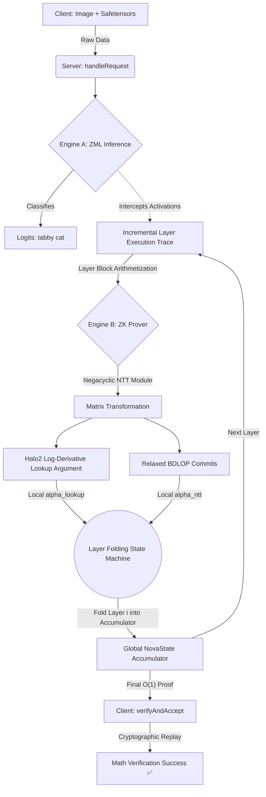
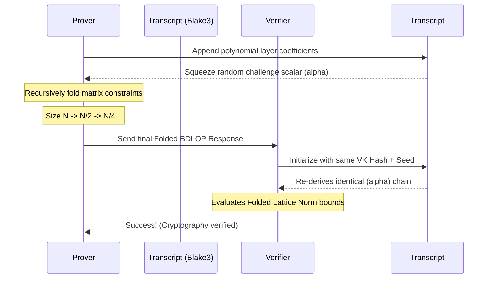
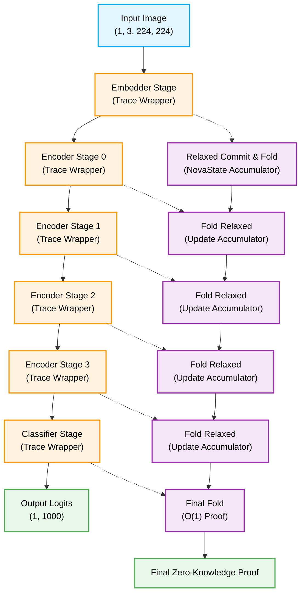

# Zero-Knowledge ResNet Simulation

Welcome to the **Zero-Knowledge ResNet-18 Simulation** project. This repository implements a full-stack, hardware-accelerated arithmetization of an image classification Neural Network using lattice-based cryptographic constraints.

By bridging ZML (Zig Machine Learning) matrix computations with the **Labrador** folding protocol and **Halo2-style** Log-Derivative Lookup Arguments, this system allows a Prover to cryptographically convince a Verifier that they correctly executed ResNet-18 on a specific image, without revealing intermediate states.

### 🟢 Current Operational Status
- **Functional End-to-End Simulation:** The `main.zig` program successfully runs a unified Prover/Verifier simulation locally on Apple Silicon.
- **Finite Fields Integration:** Fully utilizes the 64-bit Goldilocks Prime Field ($Q = 2^{64} - 2^{32} + 1$) for all matrix and tensor operations via the ZML backend.
- **Recursive Nova Folding:** Traces are captured incrementally per-layer (Embedder $\to$ Stage 3). Instead of tracking $O(NetworkDepth)$ memory, local cross-terms are folded natively into a constant-size global accumulator.

---

## 🚀 The Architecture at a Glance

This project operates on two parallel engines integrated into a unified `main.zig` client/server simulation:

1.  **Engine A (Speed - Inference):** Executes the standard ResNet-18 sequence natively on Apple Silicon accelerators via `zml`.
2.  **Engine B (Integrity - Lattice Prover):** Intercepts the generated activation trace, maps it into a mathematically rigorous finite field bounding ring ($Z_q$), and interactively folds the multi-dimensional tensor arrays down to a verifiable cryptographic scalar structure.



## 🔬 Scientific & Technical Internals

### 1. Lattice Cryptography & NTT Structures (`@zk-crypto/ntt.zig`)

At the core of the Labrador proving system is the Number Theoretic Transform (NTT) module imported from the parameterized `@zk-crypto` library.
This allows polynomial time matrix convolutions $O(N \log N)$ without floating-point precision loss.

$$X_k = \sum_{j=0}^{N-1} x_j \psi^{2j} \omega^{jk} \pmod Q$$

**Key Implementations:**
*   **Negacyclic Bounds:** We avoid convolution ring vulnerabilities by wrapping logic around the cyclotomic bounding polynomial $X^{2048} + 1$. This requires scaling sequences by $\psi$, a primitive root of unity ($\psi^2 \equiv \omega \pmod Q$), shifting the domain securely.
*   **ZML Hardware Matrix Compilation:** Rather than forcing the CPU to loop 2,048 times serially, we compile the NTT matrix $\mathbf{F}$ mathematically into `zml.Tensor`. The compilation layer issues a `stablehlo.dot_general` hardware instruction, executing 13,561 batched NTT transforms instantly!

### 2. The Labrador Folding Protocol (`@zk-crypto/labrador.zig`)

Labrador defines a recursive Polynomial Commitment sequence designed to structurally compress millions of neural network states down to $O(1)$ verification constraints, implemented generically via `@zk-crypto/labrador.zig`.

**The BDLOP Commitment Phase**
The execution trace is algebraically bonded to a public structural seed matrix $\mathbf{A}$.
$$\mathbf{t} = \mathbf{A} \cdot \mathbf{s} + \mathbf{e} \pmod Q$$
The Error tensor $\mathbf{e}$ is drawn from a deterministic Centered Binomial Distribution (CBD) bounded tightly to $L_\infty$ limits ($|e_i| \le \beta$), guaranteeing that polynomial approximations resolve while cryptographically masking the witness $s$.

**Interactive Sumcheck & Folding Rounds**
The matrices undergo geometric $\log_2(K)$ recursive folding. For each polynomial degree, the coefficients are algebraically split into even/odd structural pairs and merged based on a cryptographically squeezed Fiat-Shamir scalar $\alpha$:

$$P_{next} = P_{even} + \alpha \cdot P_{odd} \pmod Q$$



### 3. ZKML - Neural Network Arithmetization

### 3. ZKML - Neural Network Arithmetization & Recursive Folding

To prove the *execution* (not just the output), the ResNet logic is arithmetized step-by-step.

**Halo2 Log-Derivative Lookup Arguments (`zk_lookup.zig`)**
Finite fields naturally simulate addition and multiplication. They **cannot** simulate non-linear bounded choices like $ReLU(x) = \max(0, x)$ natively without exploding constraint bounds.
To bridge this, we implement a Log-Derivative rational sum. 
We commit a native bounded array table $\mathbf{T}$ containing all valid states (e.g., $1 \to 1$, $-5 \to 0$).

$$\sum_{i=0}^{|Trace|} \frac{1}{X - f_i} = \sum_{j=0}^{|Table|} \frac{m_j}{X - t_j} \pmod Q$$

By computing the native approximations over the differences $X - f_i$, and collapsing the constraints geometrically via `tensor.sum(.b).sum(.n)`, we natively assert that every single element inside the ResNet layers is absolutely a valid member of the structural truth bounds without needing interactive loop validations.

**Scalability - Recursive Layer Folding (Nova/Sangria)**
A full ResNet-18 pipeline generates roughly 27.7 million constraints. Previous ZK architectures attempted to "flatten" these activations into a sprawling 1D virtual layer constraint matrix. However, evaluating 27.7M states simultaneously over finite-field NTT algorithms instantly runs hardware out of VRAM constraints. 

To enable infinite depth neural network proofs, we implemented **Recursive Layer Folding**:
1. **Incremental Trace Wrappers (`main.zig`)**: 
   - Engine A compiles iterative ZML subgroups (`TraceWrapper_Embedder`, `TraceWrapper_StageX`). Instead of executing the entire network monolithically, trace arrays are isolated and yielded to the prover per-layer.
2. **Relaxed Commitments & Folding Setup (`labrador.zig`)**:
   - The bounding lattice operations execute against $Layer_i$ iteratively, returning structural cross-terms. We added `commitRelaxed` ($T = A \cdot s + u \cdot e$) and algebraic `foldRelaxed` algorithms to mathematically absorb subsequent sequences.
3. **Sequential Constant Space (`main.zig`)**:
   - As cross-terms are returned, they are scaled natively into a global `NovaState` accumulator struct: $E_{new} = E_{acc} + \alpha_{FS} \cdot Layer_{cross_i} \pmod Q$.
   - The memory consumption profile plummets from $O(NetworkDepth)$ strictly to localized $O(Layer)$ bounds! The final resulting generated Zero-Knowledge proof is just a condensed $O(1)$ representation of the full network's validity.



### 4. Zero-Knowledge Guarantees

*   **Cryptographically Secure Finite Fields (Goldilocks):** Modulo arithmetic natively computes matrix constraints over the 64-bit Goldilocks Prime ($Q = 2^{64} - 2^{32} + 1$). The `@zk-crypto` mathematical matrices $F$ and $F^{-1}$ are bounded securely preventing integer limit analysis on tensor structures.
*   **Zero-Knowledge Aborts (Rejection Sampling):** The prover will automatically abort during computation (handled natively by `@zk-crypto/labrador.zig`) if bounded response geometries exceed probability conditions. This guarantees no statistical leakage maps to the execution trace.
*   **Constant-Time Cryptography:** All operations governing structural bounds and polynomial mappings utilize pure bit-wise logic, eliminating branch predictability timing attacks.
*   **Comptime Verification Key (VK):** The ResNet `.safetensors` structure is uniquely determinized during Bazel AST generation. The generated structural hash guarantees that the proof strictly matches the mathematical shape of the user's local network.

---

## 🖥 Compilation & Execution

This module operates naturally inside Bazel.

```bash
# Compile and simulate a verifiable execution
# Uses ZML MLIR Compiler backend for MacOS Apple Silicon execution
bazel run //zk-resnet -- --model=$HOME/models/resnet-18 --image=$HOME/dataset/cats-image/cats_image.jpeg
```

### 🧪 Testing Submodules
Unit tests for the standalone cryptography logic are located inside the `@zk-crypto` Bazel directory:

```bash
bazel test //zk-crypto:fiat_shamir_test //zk-crypto:ntt_test_bin //zk-crypto:labrador_test_bin
```

